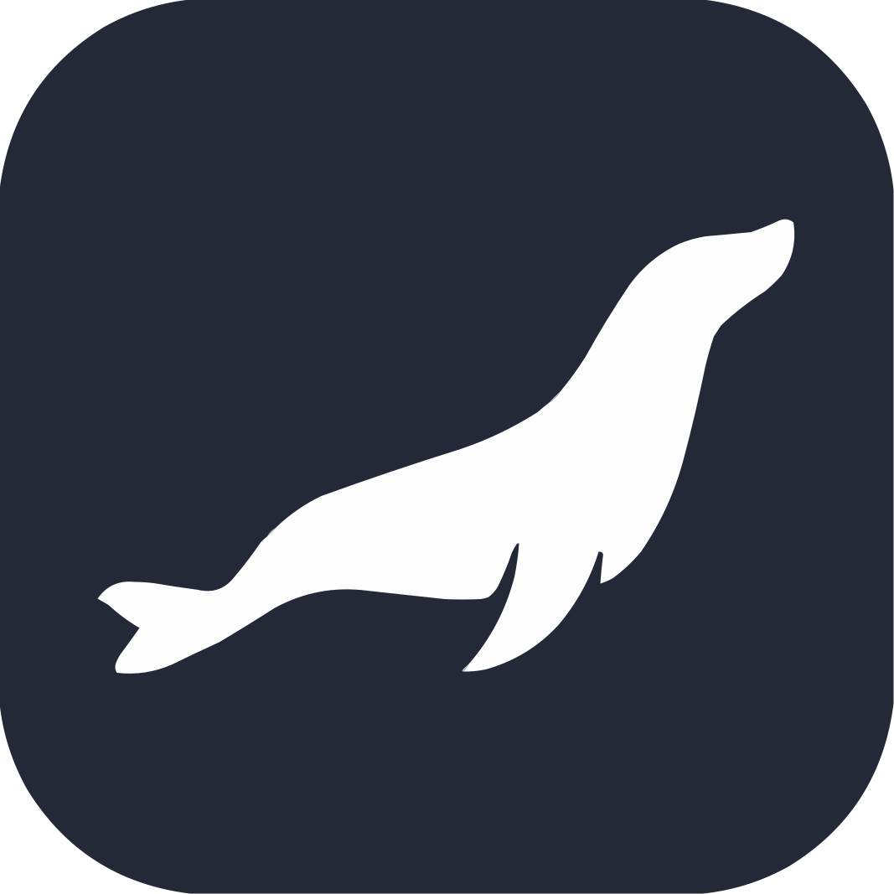

## Hey 👋, I'm Alexandre

As a Full Stack Web Developer, I have contributed to various projects designed for both educational and personal purposes. You can explore all these projects on this page.

### Main Stack

  
  
  
  

## 📭 Contact

  
  &nbsp;
  
  &nbsp;
  

## 🚀 Skills

  
  
  
  
  
  

  
  

  
  
  

  
  
  

